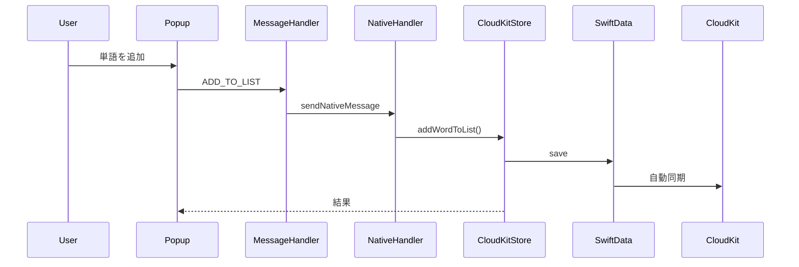
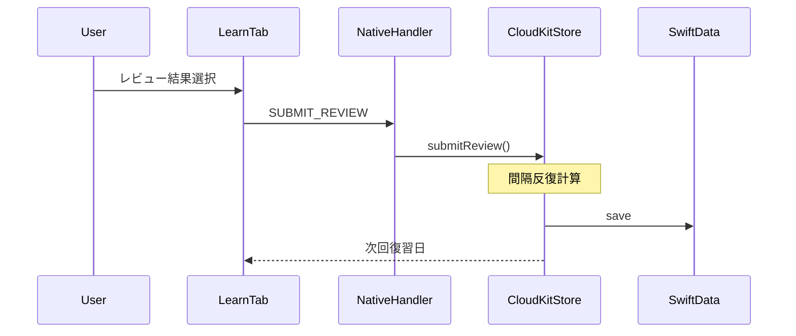

# VocabDict アーキテクチャ v2

## 概要

VocabDictは、英語学習者向けのSafari Web Extensionです。統合された辞書検索、語彙管理、間隔反復学習を通じて語彙力向上を支援します。

v2アーキテクチャでは、データ永続化層を完全にSwiftData+CloudKitに移行し、JavaScriptの責務を最小限にしました。

## コアアーキテクチャ

```
┌──────────────────────────────────────────────────────┐
│                 ユーザーインターフェース                │
│  ┌────────────┐  ┌──────────────┐  ┌─────────────┐ │
│  │   Popup    │  │Content Script│  │Context Menu │ │
│  │  (400x600) │  │  (iOS button)│  │   (macOS)   │ │
│  └────────────┘  └──────────────┘  └─────────────┘ │
└──────────────────────────────────────────────────────┘
                           │
                   メッセージパッシング
                   (browser.runtime)
                           ▼
┌──────────────────────────────────────────────────────┐
│              Background Service Worker                │
│         メッセージをNativeへルーティングのみ           │
└──────────────────────────────────────────────────────┘
                           │
               browser.runtime.sendNativeMessage
                           ▼
┌──────────────────────────────────────────────────────┐
│           Native Layer (Swift)                        │
│         SafariWebExtensionHandler                     │
└──────────────────────────────────────────────────────┘
                           │
                           ▼
┌──────────────────────────────────────────────────────┐
│              CloudKitStore (Swift)                    │
│         すべてのビジネスロジックとデータ操作            │
└──────────────────────────────────────────────────────┘
                           │
                           ▼
┌──────────────────────────────────────────────────────┐
│           データ永続化層 (SwiftData)                   │
│         App Group共有ストレージ                        │
└──────────────────────────────────────────────────────┘
                           │
                   CloudKit自動同期
                   (.automatic mode)
                           ▼
┌──────────────────────────────────────────────────────┐
│              CloudKit (iCloud)                        │
│         全デバイス間でのデータ同期                      │
└──────────────────────────────────────────────────────┘
```

## 主要な変更点（v1 → v2）

### 1. データ永続化層の完全移行
- **削除**: `browser.storage.local` APIとStorageManager
- **導入**: SwiftData + CloudKit
- **利点**: ストレージ制限解消、デバイス間自動同期

### 2. ビジネスロジックのSwift移行
- **削除**: JavaScript側のサービスレイヤー（SpacedRepetition等）
- **移行先**: CloudKitStore（Swift）
- **利点**: JavaScriptは純粋なメッセージングレイヤーに

### 3. 簡素化されたメッセージフロー
- **旧**: JS → Services → StorageManager → browser.storage
- **新**: JS → Native Handler → CloudKitStore → SwiftData

## コンポーネントの責務

### JavaScript層（最小限の責務）
- **UI表示**: Popup、Content Script、Context Menu
- **メッセージング**: ユーザー操作をNativeへ転送
- **辞書データ**: 読み取り専用の辞書サービス（DictionaryService）のみ残存

### Native層（Swift）
- **SafariWebExtensionHandler**: JSからのメッセージ受信とルーティング
- **CloudKitStore**: すべてのビジネスロジックとデータ操作
  - 語彙リスト管理
  - 間隔反復学習アルゴリズム
  - 検索履歴
  - ユーザー設定
  - 統計情報

### データ層
- **SwiftData**: ローカルデータ永続化
- **App Group**: AppとExtension間でのデータ共有
- **CloudKit**: デバイス間での自動同期

## メッセージフロー

### 単語追加の例


### レビュー送信の例


## データ同期メカニズム

### ローカル同期（App Group）
- `ModelContext.save()` で即座に保存
- 同一デバイス内のApp/Extension間で共有

### クラウド同期（CloudKit）
- `.automatic` モードで自動同期
- プロセスが動作中に同期実行
- iOS/macOS間でシームレスに共有

## 主要な設計原則

1. **Swift First**: ビジネスロジックはSwift側に集約
2. **メッセージ駆動**: コンポーネント間は疎結合
3. **自動同期**: ユーザーは同期を意識しない
4. **最小限のJS**: JavaScriptは表示とメッセージングのみ

## プラットフォーム考慮事項

### Safari Extension制限
- ES6モジュール非対応（webpack必須）
- browser.* APIのみ使用
- テーマ自動検出不可

### iOS vs macOS
- **iOS**: テキスト選択ボタンUI
- **macOS**: コンテキストメニュー統合
- 両プラットフォームで同一データストア共有

## 開発ガイド

### 新機能追加の流れ
1. SwiftDataモデルを定義
2. CloudKitStoreにビジネスロジック実装
3. SafariWebExtensionHandlerにルーティング追加
4. JavaScript側でUIとメッセージング実装

### デバッグポイント
- JS側: console.logでメッセージ確認
- Native側: SafariWebExtensionHandlerでログ出力
- データ: CloudKit Dashboardで同期状態確認

## まとめ

VocabDict v2は以下を実現：
- **データ永続化をSwiftDataに統一** - browser.storageの制限から解放
- **ビジネスロジックをSwiftに集約** - メンテナンス性の向上
- **CloudKitで自動同期** - シームレスなマルチデバイス体験
- **シンプルなアーキテクチャ** - 理解しやすく拡張しやすい設計