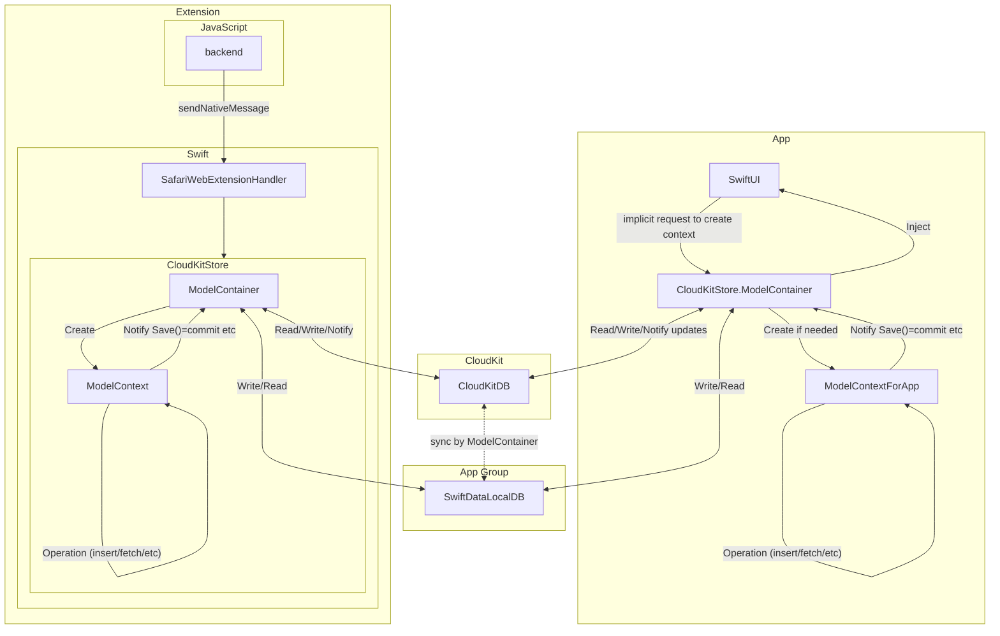
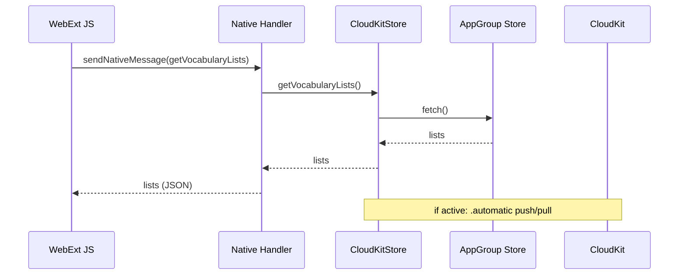
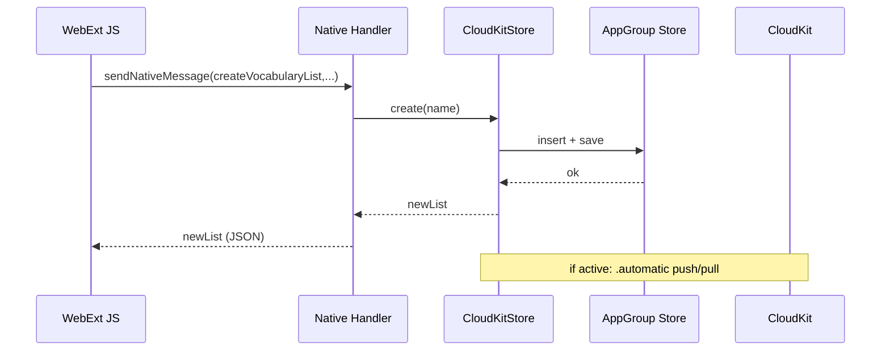

# データ永続化アーキテクチャ

SwiftData × CloudKit × App Group × Safari Web Extension（JS/Native）によるデータの永続化のアーキテクチャを記載する。

## 0. 用語（このドキュメントでの意味）

* **App Group コンテナ**
  OS が用意する**共有フォルダ**。同じ App Group ID を持つ App / Extension がここに置かれた同一ファイルへアクセスできる。
  ※実装では、ストアファイル（例：`VocabDict.store`）を **App Group コンテナ直下**に作っています（`CloudKitStore` 参照）。

* **SwiftData の ModelContainer**
  **ストア（SQLite）と同期エンジン**を束ねる“箱”。アプリ側の世界からは **ModelContainer を 1個作って**使うイメージ。

  * **ModelContext** … コンテナにぶら下がる**編集セッション**。`insert/fetch/save` を行う単位（Core Data の MOC に相当）。
  * **Schema** … そのコンテナで扱う **全 `@Model` 型の集合**。SwiftData は **Schema に含めた型しか保存・同期しない**。
    （実装では `Schema([VocabularyList.self])` のように配列で渡しています。将来モデルが増えたらこの配列に足します。）

* **CloudKit 自動同期（`.automatic`）**
  ModelContainer の設定。オンにすると **ローカル変更が CloudKit へ送られ、クラウドの変更がローカルに取り込まれる**。
  取り込みタイミングは OS/フレームワーク管理（後述「データが更新されるタイミング」）。

* **Safari Web Extension**
  * **JS 部分** … `browser.runtime.sendNativeMessage(...)` でネイティブ側へ依頼・結果受信。
  * **ネイティブ部分**（`SafariWebExtensionHandler`）… JS からのアクションを受け取り、**`CloudKitStore` を通じて SwiftData を操作**して返答。

-----

## Note: ModelContainer と ModelContext の違い

● **ModelContainer（モデルコンテナ）**
* 何者？
  * **ストアと同期の“箱”**。どの保存先（App Group 内のファイルか？）、どのクラウド（CloudKit コンテナか？）、どのモデル群（Schema）を扱うか、という**全体設定**をまとめた器。
* 役割
  * 永続ストア（SQLite）の配置・オープン
  * CloudKit 自動同期（`.automatic`）の有無と、その制御
  * どの `@Model` 型を保存対象にするか（= **Schema**）の保持
  * **Context を生み出す親**（mainContext / 明示的に `ModelContext(container)` で作る）
* いつ/どこで作る？
  * **プロセスにつき原則1つ**。あなたの実装では **`CloudKitStore.shared.modelContainer`** を App でも Extension でも共有しています。
  * SwiftUI では `.modelContainer(container)` を 1 回環境注入して全画面から使えるようにする（`VocabDict.swift` 参照）。
* 実装上のヒント
  * **Schema** は「このコンテナが扱う `@Model` の集合」。新しい `@Model` を足したら **Schema の配列に追加**（App と Extension で **同じ Schema** を登録する）。
  * ストアの置き場（App Group の URL）や `cloudKitDatabase: .automatic` など\*\*“仕組み系設定”はコンテナ側\*\*に集約。

● **ModelContext（モデルコンテキスト）**
* 何者？
  * **読み書きの作業場**。コンテナにぶら下がる**編集セッション**で、フェッチ・挿入・更新・削除・`save()` を担う。Core Data の MOC の立ち位置。
* 役割
  * `fetch(FetchDescriptor<...>)`、`insert(...)`、`delete(...)`、`save()` の実行主体
  * \*\*未保存の変更（トランザクション的な作業内容）\*\*を一時保持し、`save()` でストアに反映
* いつ/どこで作る？
  * 使い方は2通り：
    1. **メインの文脈**… `container.mainContext`（SwiftUI なら `@Environment(\.modelContext)` で取れる）
    2. **作業用の別文脈**… `let ctx = ModelContext(container)` で**別コンテキスト**を作る（重い処理や一時的トランザクションに）
  * あなたの実装では `CloudKitStore.shared` 内で **`modelContext` を1つ用意**し、CRUD 全部そこから行っています。
* 実装上のヒント
  * `autosaveEnabled = true` を使うと軽い変更は自動保存されやすくなるが、**確実な単位では `save()` を呼ぶ**。
  * **スレッド/Actor ごとに1コンテキスト**が基本（同一コンテキストを並列に触らない）。
  * **別プロセス（App と Extension）**は当然**別のコンテキスト**。ファイル共有なので保存後は次のフェッチで見えるが、**自動マージされるわけではない**ことに注意（必要に応じてリフェッチする前提の設計に）。

### まとめ（手短に）

* **Container = 仕組みの箱（保存先・CloudKit・Schema の設定）**
* **Context = 作業場（フェッチ/変更/保存の単位）**
* **コンテナは原則1（プロセスごと）**、**コンテキストは用途に応じて複数**。
* あなたの構成では **App も Extension も “同じ設定のコンテナ” を持ち（CloudKit も .automatic）**、各プロセス内の **コンテキスト**が CRUD と `save()` を実行しています。保存すれば **App Group の同じDB**が更新され、**プロセスが動作中なら CloudKit 同期**が進む、という流れです。
---

## 1. 概要（一枚で把握）

**ポイント（実装準拠）**

* App も Extension も **同じ `CloudKitStore.shared`** を使い、**同じストアファイル**（App Group）を開く。
* **両者とも `.automatic`** で CloudKit と直接同期する（= どちらが起点でもクラウド反映され得る）。
* JS は **ネイティブへメッセージ**を送り、ネイティブが **SwiftData を操作**して結果を JSON で返す。

---

## 2. 初期化と責務の分離（実装の読み解き）

* **CloudKitStore**（App / Extension 共通で利用）
  * App Group の URL を取得 → **ストアファイル名を明示**して `ModelContainer` を構築。
  * `Schema([...])` に該当 `@Model` を登録。
  * `ModelConfiguration(..., url: storeURL, cloudKitDatabase: .automatic)` で **自動同期オン**。
  * `ModelContext.autosaveEnabled = true`。
  * CRUD（一覧取得、作成、更新）と、**同期状態の簡易診断ログ**メソッドを提供。

* **SafariWebExtensionHandler**（ネイティブ側の入口）
  * `beginRequest` 内で `action` に応じて `CloudKitStore` を呼び分け。
  * \*\*辞書（JSON化可能な形）\*\*にして `completeRequest` で JS へ返す。
  * 学習用にアクション直後の**同期状況ログ**呼び出しが入っている。

* **WebExtension（JS）**
  * `browser.runtime.sendNativeMessage({ action: "..." , ... })` でネイティブに依頼。
  * 返ってきた辞書をもとに UI/状態を更新。
  * 一部、JS 内でも一時的な構造（クラス/JSON）を扱うが、**永続化は最終的にネイティブ側の SwiftData**。

---

## 3. データが更新されるタイミング（正確版：プロセス/OS別）

### 3-1. ローカル（App Group のストア）

* **`ModelContext.save()` を呼んだ瞬間に**、**当該プロセスのローカルストア**が更新される。
* \*\*別プロセス（App ↔ Extension）\*\*からは、
  * 即座に“通知”されるわけではない（コンテキストは共有していないため）。
  * **再フェッチ／新たなコンテナ初期化**などを行うと、直近のファイル内容を読み取れる。
  * 実装では、ネイティブ側は毎回フェッチして結果を返すため、**次のリクエスト時点で最新が見える**のが基本的挙動。

### 3-2. クラウド（CloudKit との同期）

* **前提**：`.automatic` が有効なら、\*\*プロセスが“動作中”\*\*に **アップロード/ダウンロード**が進む。
* **iOS（Host App）**
  * **前景/背景**で動作中：同期が走る。
  * \*\*完全終了（スワイプで kill）\*\*中：同期は停止。**次回起動時**に取り込み。
  * **Background Modes の remote-notification を付与**していれば、**サイレントプッシュで起動**→取り込みが進む可能性がある。

* **macOS（Host App）**
  * **起動中（ウィンドウ閉じてもプロセスが常駐）**：同期が走る。
  * **完全終了**：同期は停止。**次回起動時**に取り込み。
  * “プッシュで自動再起動”は期待しない（常駐させるならログイン項目など運用で）。

* **Safari Web Extension（Native Handler）**
  * **Safari が動作し、拡張のネイティブが生きている**間は `.automatic` が動く。
  * **拡張プロセスが生きていない**間は同期は止まる（起動すると再開）。
  * 拡張自体は**リモート通知の対象ではない**想定。**起動＝Safari/拡張が活動**していることが同期の条件。

> まとめ：\*\*“コンテナが開いていて、プロセスが実行中”\*\*であることが同期の前提。
> どの端末／どのプロセス側が先に同期してもよいよう、**最終的には CloudKit に集約**される設計です。

---

## 4. JS ↔ ネイティブの契約（変わりにくい“境界”の仕様）

* **リクエスト（JS → ネイティブ）**
  * 形式：`{ action: string, ...payload }`
  * 例：`{ action: "getVocabularyLists" }`
    ` { action: "createVocabularyList", name: "..." }`
    ` { action: "addWordsToVocabularyList", listId: "...", words: {...} }`

* **レスポンス（ネイティブ → JS）**
  * 形式：`{ <data fields...> }` または `{ error: "..." }`
  * 返送は `NSExtensionItem.userInfo[SFExtensionMessageKey]` に辞書を詰めて `completeRequest`。

* **型変換の原則**
  * Swift の `@Model` はそのまま JS に渡せない。**辞書/配列/プリミティブ**のみ。
  * 日付などは **ISO8601 文字列**など、**言語非依存**の表現に正規化する。

---

## 5. モデルが増えたとき（汎用ルール）

1. **`@Model` を定義**する。
2. **`Schema([...])` に新型を追加**する（App/Extension 共通の `CloudKitStore` で一元管理）。
3. **JS へ返すときの辞書化（JSON 化）関数**を用意する（Swift ⇔ JS 境界）。
4. 必要なら **ネイティブの `action` を追加**し、**JS 側の呼び出し**を増やす。
5. 競合・冪等性が必要な箇所は**キー正規化／upsert ポリシ**を決める。
   （例：同一キーの重複はスキップ、ラストライター優先、など）

> これらは“仕組み”で変わらない。**モデル名が増えても、この流れだけ守ればアウトデートしにくい**。

---

## 6. テキスト図：代表シーケンス（読取→作成→更新）

### 読み取りシーケンス

### 書き込みシーケンス

---

## 7. 運用とトラブルシュート（仕組み別に）

* **見えない/古いデータが返る**

  * ネイティブで**毎回フェッチ**する（実装はそうなっている）。
  * それでも古いなら、**別プロセスでまだ保存されていない**か、**まだ CloudKit から取り込まれていない**可能性。
* **同期が進まない**

  * 対象プロセス（App/Extension）が**動作中か**を確認。
  * iOS は **Background（remote-notification）** を付与しておくと取り込み機会が増える。
  * macOS は**完全終了中は止まる**。常駐運用（ログイン項目）で改善。
* **CloudKit のスキーマ/レコード確認**

  * SwiftData は CloudKit に自動で\*\*`CD_<Model名>` 形式\*\*のレコードタイプを作る。
  * 実装には**デバッグ用の直接クエリ**がある（本番はログを抑制）。

---

## 8. 今の実装での“現状値”（非規範・参考）

* **App Group ID**：`group.com.vocabdict.shared`
* **CloudKit コンテナ**：`iCloud.com.vocabdict.sync`
* **ストアファイル名**：`VocabDict.store`
* **両者で同じ CloudKitStore**：App も Extension も **`.automatic`** を有効にした同一実装を利用
* **代表アクション**：`getVocabularyLists` / `createVocabularyList` / `addWordsToVocabularyList`（今後増減あり）

> これらは“今このリポジトリでの既定値”であり、将来変えても本ドキュメントの**仕組み**はそのまま有効です。

---

